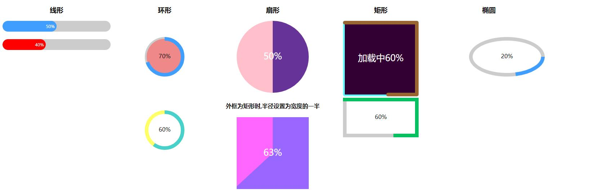
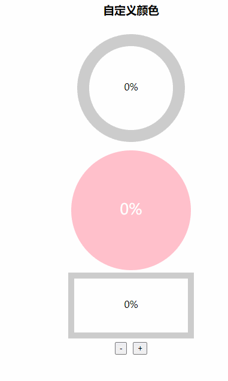
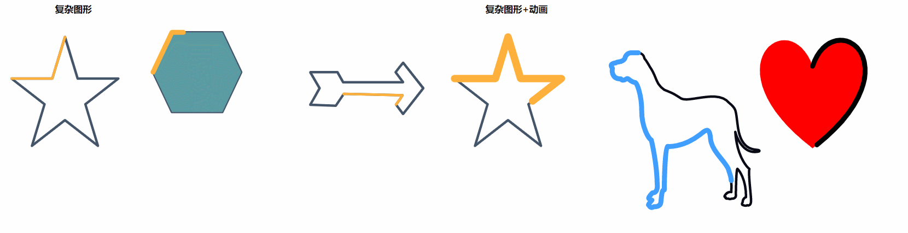
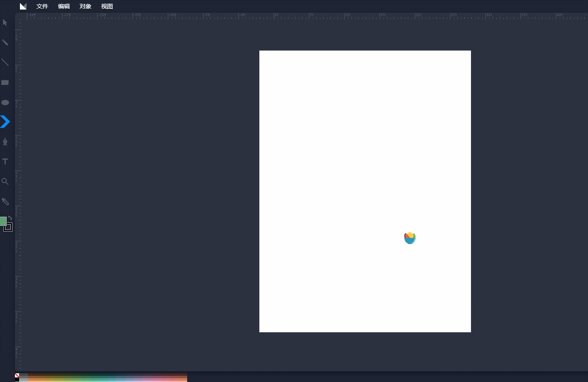

# hemy-progress
使用svg制作进度条,线条形,环形,扇形,矩形,椭圆的常规图形进度条,也可以制作其他复杂图形的进度条,三角形,多边形,自定义图形等
# 实例
### 常规图形

### 自定义颜色配置

### 复杂图形


#### 复杂图形的制作
可在在线的svg制作工具上,选择或者画出想要的图形,比如:菜鸟工具 https://c.runoob.com/more/svgeditor/
复制画布的width和height和最后一个path的d值到组件上,设置合适的pathLength,再设置其他自己喜欢的属性值

``` 
<Progress
  d="m205.58865,207.26894c4.72522,-5.9053 9.24437,-12.71333 13.22542,-18.82466l-119.28624,-2.80423l-16.36196,24.14976l-51.83504,-2.07417c6.49499,-10.99509 13.61002,-23.91136 18.88519,-33.61275l-18.76473,-32.61405l55.30683,0l11.25319,20.37749l121.78832,0l-15.1069,-20.33188c4.66219,-6.40735 11.56197,-14.95808 15.30486,-19.44136l40.95944,51.81951l-41.05261,52.62338l-14.31579,-19.26703l0.00002,0.00001z"
  type="path"
  backStrokeColor="#445469"
  fillColor="none"
  :strokeWidth="5"
  :pathLength="2000"
  :percentage="20"
  :width="300"
  :height="600"
  strokeLinejoin="round"
  strokeLinecap="round"
  strokeColor="#feb23c"
/>
```

# 使用
<table>
  <tr>
    <th>表格</th>
    <th>值类型</th>
    <th>是否必填</th>
    <th>描述</th>
    <th>默认值</th>
  </tr>
  <tr>
    <td>type</td>
    <td>String</td>
    <td>否</td>
    <td>进度条类型,line=线条,circle=环形</td>
    <td>line</td>
  </tr>
  <tr>
    <td>percentage</td>
    <td>Number</td>
    <td>是</td>
    <td>进度条百分比</td>
    <td>100</td>
  </tr>
    <tr>
    <td>fillColor</td>
    <td>String</td>
    <td>否</td>
    <td>闭合图形填充颜色,type!==line生效</td>
    <td>none</td>
  </tr>
   <tr>
    <td>strokeColor</td>
    <td>String,Function,Array</td>
    <td>否</td>
    <td>进度条颜色,可接受字符串,参数为percentage的函数,数组,
        ['#f56c6c','#e6a23c','#5cb87a','#1989fa','#6f7ad3']
        或者
        [
          {color: '#f56c6c', percentage: 20},
          {color: '#e6a23c', percentage: 40},
          {color: '#5cb87a', percentage: 60},
          {color: '#1989fa', percentage: 80},
          {color: '#6f7ad3', percentage: 100}
        ]
    </td>
    <td>#409eff</td>
  </tr>
  <tr>
    <td>backStrokeColor</td>
    <td>String</td>
    <td>否</td>
    <td>背景进度条颜色</td>
    <td>#eee</td>
  </tr>
    <tr>
    <td>backStrokewidth</td>
    <td>Number</td>
    <td>否</td>
    <td>背景进度条宽度</td>
    <td>5</td>
  </tr>
   <tr>
    <td>textStyle</td>
    <td>Object</td>
    <td>否</td>
    <td>文字样式,例:{color:'red',fontSize:'25px'}</td>
    <td>{}</td>
  </tr>
  <tr>
    <td>showText</td>
    <td>Boolean</td>
    <td>否</td>
    <td>是否显示文字</td>
    <td>true</td>
  </tr>
   <tr>
    <td>format</td>
    <td>function(percentage)</td>
    <td>否</td>
    <td>自定义进度条文字内容</td>
    <td></td>
  </tr>
  <tr>
    <td>width</td>
    <td>Number</td>
    <td>否</td>
    <td>画布宽,当type=circle为画布大小,type=rect时为矩形宽</td>
    <td>200</td>
  </tr>
  <tr>
    <td>height</td>
    <td>Number</td>
    <td>否</td>
    <td>画布高,type=rect时为矩形高</td>
    <td>200</td>
  </tr>
  <tr>
    <td>strokeWidth</td>
    <td>Number</td>
    <td>否</td>
    <td>环形宽度,type=circle时生效</td>
    <td>10</td>
  </tr>
  <tr>
    <td>strokeLinecap</td>
    <td>String</td>
    <td>否</td>
    <td>环形条线帽,butt:正常结尾,round:圆润,square:两端为方形</td>
    <td>round</td>
  </tr>
   <tr>
    <td>strokeLinejoin</td>
    <td>String</td>
    <td>否</td>
    <td>线段连接处的样式,miter:正常连接,round:圆润,bevel:切除连接处的尖尖部分</td>
    <td>miter</td>
  </tr>
    <tr>
    <td>strokeMiterlimit</td>
    <td>Number</td>
    <td>否</td>
    <td>连接处宽度和线条宽度的比</td>
    <td>4</td>
  </tr>
  <tr>
    <td>radius</td>
    <td>Number</td>
    <td>否</td>
    <td>环形半径</td>
    <td>50</td>
  </tr>
  <tr>
    <td>isFan</td>
    <td>Boolean</td>
    <td>否</td>
    <td>是否为扇形,type=circle时生效</td>
    <td>false</td>
  </tr>
  <tr>
    <td>borderRadius</td>
    <td>Number</td>
    <td>否</td>
    <td>type=rect的圆角半径</td>
    <td>0</td>
  </tr>
  <tr>
    <td>rx</td>
    <td>Number</td>
    <td>否</td>
    <td>type=ellispe椭圆时的长半轴</td>
    <td>100</td>
  </tr>
  <tr>
    <td>ry</td>
    <td>Number</td>
    <td>否</td>
    <td>type=ellispe椭圆时的短半轴</td>
    <td>50</td>
  </tr>
  <tr>
    <td>pathLength</td>
    <td>Number</td>
    <td>否</td>
    <td>自定义图形路径的总长度,如果存在，路径将进行缩放，以便计算各点相当于此值的路径长度</td>
    <td>1000</td>
  </tr>
   <tr>
    <td>d</td>
    <td>String</td>
    <td>否</td>
    <td>当type=path,图形的定义路径,必填</td>
    <td></td>
  </tr>
</table>