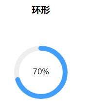
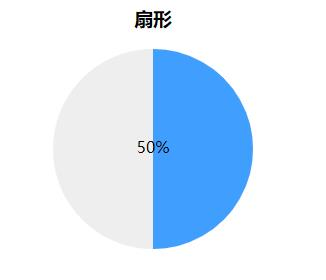

# hemy-progress
进度条(vue)
# 实例

# 使用
<table>
  <tr>
    <th>表格</th>
    <th>值类型</th>
    <th>是否必填</th>
    <th>描述</th>
    <th>默认值</th>
  </tr>
  <tr>
    <td>type</td>
    <td>String</td>
    <td>否</td>
    <td>进度条类型,line=线条,circle=环形</td>
    <td>line</td>
  </tr>
  <tr>
    <td>percentage</td>
    <td>Number</td>
    <td>是</td>
    <td>进度条百分比</td>
    <td>100</td>
  </tr>
   <tr>
    <td>strokeColor</td>
    <td>String</td>
    <td>否</td>
    <td>进度条颜色</td>
    <td>#409eff</td>
  </tr>
   <tr>
    <td>traiColor</td>
    <td>String</td>
    <td>否</td>
    <td>进度条背景颜色</td>
    <td>#eee</td>
  </tr>
   <tr>
    <td>textStyle</td>
    <td>Object</td>
    <td>否</td>
    <td>文字样式,例:{color:'red',fontSize:'25px'}</td>
    <td>{}</td>
  </tr>
  <tr>
    <td>showText</td>
    <td>Boolean</td>
    <td>否</td>
    <td>是否显示文字</td>
    <td>true</td>
  </tr>
   <tr>
    <td>format</td>
    <td>function(percentage)</td>
    <td>否</td>
    <td>自定义进度条文字内容</td>
    <td></td>
  </tr>
  <tr>
    <td>width</td>
    <td>Number</td>
    <td>否</td>
    <td>画布大小,type=circle时生效</td>
    <td>200</td>
  </tr>
  <tr>
    <td>strokeWidth</td>
    <td>Number</td>
    <td>否</td>
    <td>环形宽度,type=circle时生效</td>
    <td>10</td>
  </tr>
  <tr>
    <td>strokeLinecap</td>
    <td>String</td>
    <td>否</td>
    <td>环形条线帽</td>
    <td>round</td>
  </tr>
  <tr>
    <td>radius</td>
    <td>Number</td>
    <td>否</td>
    <td>环形半径</td>
    <td>50</td>
  </tr>
  <tr>
    <td>isFan</td>
    <td>Boolean</td>
    <td>否</td>
    <td>是否为扇形,type=circle时生效</td>
    <td>false</td>
  </tr>
</table>